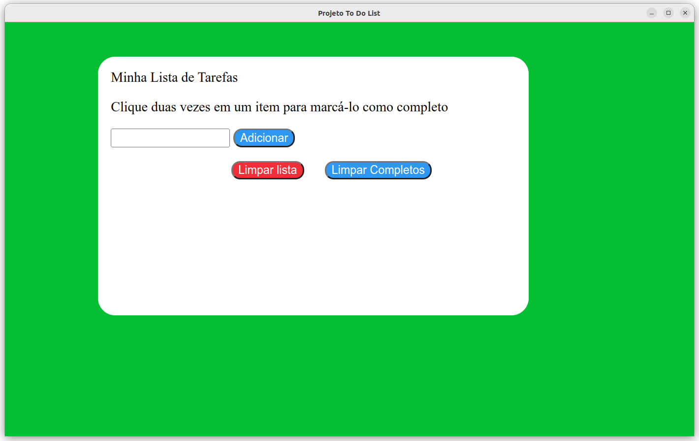

# Lista de Tarefas

## Contexto

Este projeto trata-se de lista de tarefas onde é possivel *adicionar, selecionar, marcar como concluido, limpar todas as tarefas* ou apenas as marcadas.

## Aplicação



> Eu desenvolvi os arquivos `index.html`, `script.js`, `style.css`, `README.md` e as captudas `Alicacao.png`, `live-server`.

- Todos arquivos exeto os citados acima foram desenvolvidos pela [Trybe](https://www.betrybe.com/).

## Técnologias usadas

Front-end:
> Desenvolvido usando: HTML, CSS, JavaScript

## Instalando Dependências

- clone o projeto:

  ```bash
  git clone git@github.com:Andreyrvs/04-Todo-List.git
  ```

## Executando aplicação

- Para rodar o front-end:

  ```bash
  cd 04-Todo-List
  ```

Clique duas vezes no arquivo `index.html`

> A aplicação utiliza a resolução **1366 x 768**
