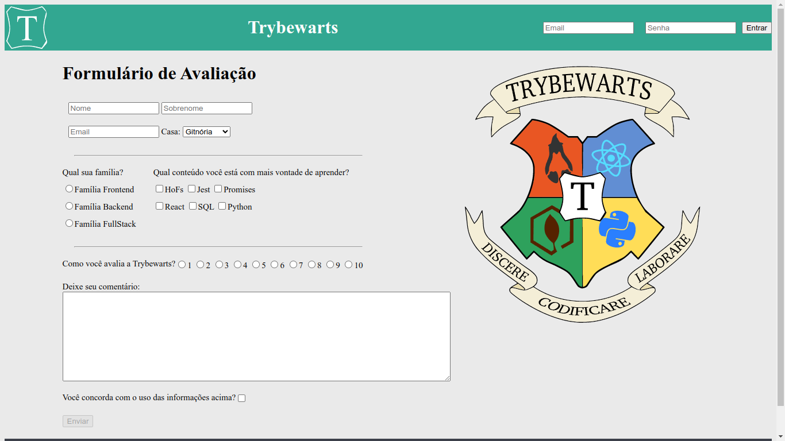

# Trybewarts Wizarding School

## Contexto

Projeto realizado em dupla com [Julio Rieger](https://www.linkedin.com/in/juliorieger/ "linkedin")

Este projeto é uma página de formulário da Escola de Magia de Trybewarts, em que as pessoas estudantes poderão enviar seus feedbacks sobre ela. *O tema desse projeto é baseado na obra 'Harry Potter', de J.K. Rowling*.

## Aplicação

utilize o email **tryber@teste.com** e senha **123456**



> O diretorio: images/ Foi disponibilizado Pela [TRYBE](https://www.betrybe.com/). Eu utilizo as imagens nesse projeto

## Técnologias usadas

Front-end:
> Desenvolvido usando: HTML, CSS, CSS Flexbox, JavaScript

## Instalando Dependências

* clone o projeto:

  ```bash
  git clone git@github.com:Andreyrvs/08-Trybewarts.git
  ```

## Executando aplicação

* Para rodar o front-end:

  ```bash
  cd 08-Trybewarts
  ```

* Clique duas vezes no arquivo `index.html`

> A aplicação utiliza a resolução 1366 x 768
