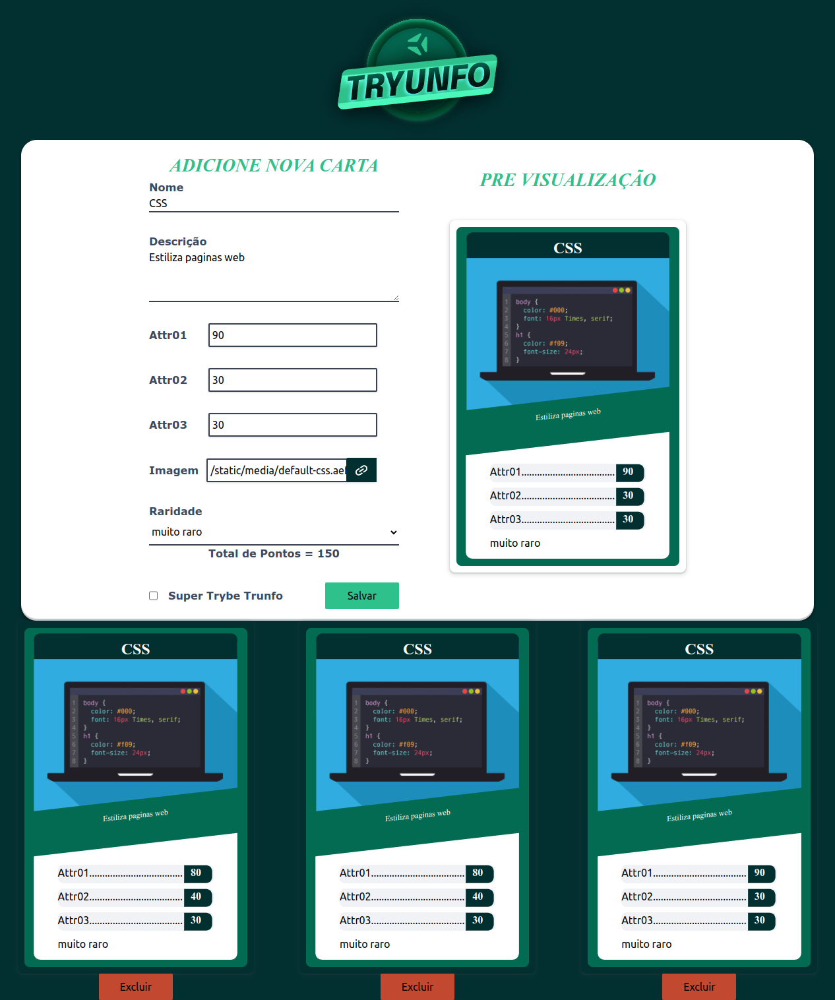

# Tryunfo

## Contexto

Este projeto trata-se de um jogo no estilo Super Trunfo! Ao utilizar essa aplicação uma pessoa usuária deverá ser capaz de:

Criar um baralho, com o tema livre;

Adicionar e remover uma carta do baralho;

Visualizar todas as cartas que foram adicionadas ao baralho;

Jogar com o baralho criado.

## Técnologias usadas

Front-end:
> Desenvolvido usando: React, PropTypes, TailwindCSS, JavaScript ES6

## Habilidades

Neste projeto, verificamos se você é capaz de:

- Ler o estado de um componente e usá-lo para alterar o que exibimos no navegador

- Inicializar um componente, dando a ele um estado pré-definido

- Atualizar o estado de um componente.

- Capturar eventos utilizando a sintaxe do React.

- Criar formulários utilizando sintaxe JSX com as tags: `input`, `textarea`, `select`, `form`, `checkbox`.

- Transmitir informações de componentes filhos para componentes pais via callbacks

## Preview da Aplicação

|  |  |
| ----------- | ----------- |

## Instalando Dependências

- clone o projeto:

```bash
git clone git@github.com:Andreyrvs/13-Tryunfo-React.git
```

> Frontend

```bash
cd 13-Tryunfo-React
npm install
```

## Executando aplicação

- Para rodar o front-end:

```bash
  cd src/ && npm start
```
