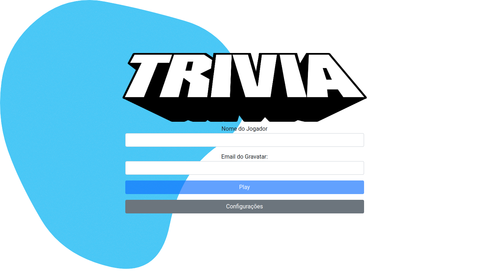
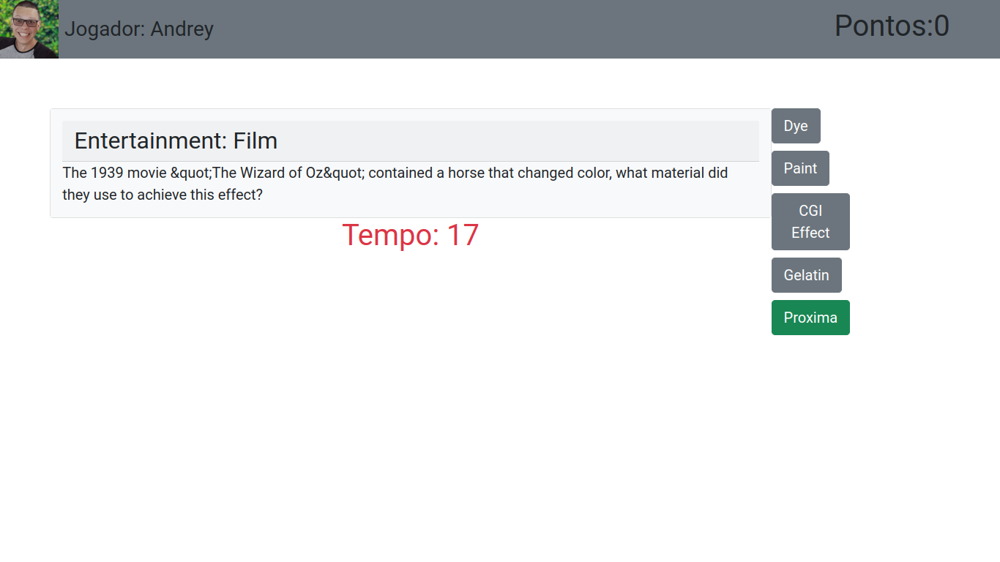

# Trivia React Redux

## Contexto

Este projeto trata-se um jogo de perguntas e respostas baseado no jogo Trivia (tipo um show do milhão americano)

> Utiliza a API [Open TRIVIA database](https://opentdb.com/)

Colegas que contribuíram para a realização do projeto:

- [@gsmunizz](https://github.com/gsmunizz "github")
- [@gabrielmendesa](https://github.com/gabrielmendesa "github")

## Técnologias usadas

Front-end:
> Desenvolvido usando: React, React Router, Redux, Redux Thunk, Bootstrap 5, Kanban

## Habilidades

Adquiri essas habilidades ao desenvolver esse projeto:

- Criar um store Redux em aplicações React;

- Criar reducers no Redux em aplicações React;

- Criar actions no Redux em aplicações React;

- Criar dispatchers no Redux em aplicações React;

- Conectar Redux aos componentes React;

- Criar actions assíncronas na sua aplicação React que usa Redux.

- Escrever testes para garantir que sua aplicação possua uma boa cobertura de testes.

## Preview da Aplicação

|  |  |
| ----------- | ----------- |

## Instalando Dependências

- Clone o projeto:

  ```bash
  git clone git@github.com:Andreyrvs/18-Trivia-React-Redux.git
  ```

  > Front-end

  ```bash
  cd 18-Trivia-React-Redux/
  npm install
  ```

## Executando aplicação

- Para rodar o Front-end:

  ```bash
  cd src/ && npm start
  ```

> A aplicação utiliza a resolução **1366 x 768**
