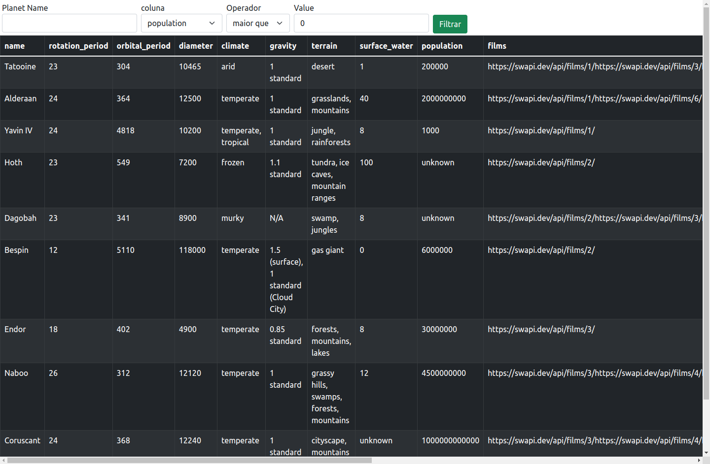
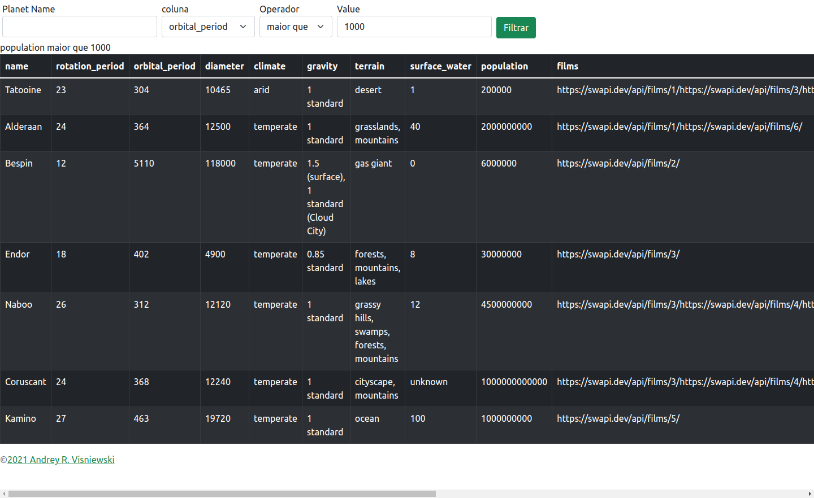

# Starwars Planet Search

## Contexto

Este projeto trata-se de uma lista de filtros de planetas do universo Star Wars utiliza Context API e Hooks para controlar estados globais.

> Utiliza a API [StarWars](https://swapi.dev/)

- Filtros:

  É possivel filtrar pelo nome do planeta e caracteristicas do planeta: População, período orbital, diâmetro, período de rotação, superfície da água.

- É possivel unir filtros:

  `rbital_period | maior que | 400`

## Técnologias usadas

Front-end:
> Desenvolvido usando: React, React Hooks, React Context API, Bootstrap

## Habilidades

Adquiri essas habilidades ao desenvolver esse projeto:

- Utilizar a Context API do React para gerenciar estado;

- Utilizar o React Hook useState;

- Utilizar o React Hook useContext;

- Utilizar o React Hook useEffect;

- Criar React Hooks customizados;

## Preview da Aplicação

|  |  |
| ----------- | ----------- |

## Instalando Dependências

- Clone o projeto:

  ```bash
  git clone git@github.com:Andreyrvs/19-Starwars-Planet-Search.git
  ```

  > Front-end

  ```bash
  cd 19-Starwars-Planet-Search
  npm install
  ```

## Executando aplicação

- Para rodar o Front-end:

  ```bash
  cd src/ && npm start
  ```
