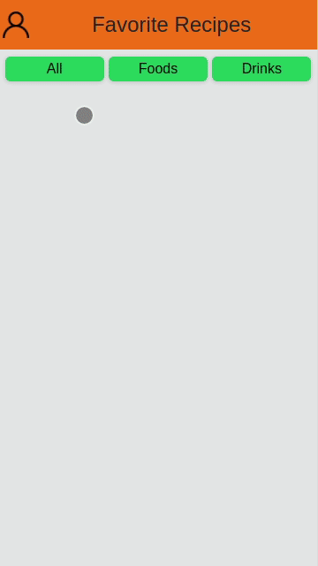

# App de Receitas

## Contexto

Este projeto trata-se de um app de receitas, utilizando o que há de mais moderno dentro do ecossistema React: Hooks e Context API!. Nele é possível ver, buscar, favoritar e acompanhar o progresso de receitas e drinks. O layout tem como foco dispositivos móveis,

Colegas que contribuíram para a realização do projeto:

- [@GabrielzinJacques](https://github.com/GabrielzinJacques "github")
- [@TalisonSantana](https://github.com/TalisonSantana "github")
- [@mmdec](https://github.com/mmdec "github")

> Utiliza APIs:
>
> [TheMealDB API](https://www.themealdb.com/api.php) é um banco de dados aberto, mantido pela comunidade, com receitas e ingredientes de todo o mundo.
>
> [The CockTailDB API](https://www.thecocktaildb.com/api.php) Bem similar (inclusive mantida pela mesma entidade) a TheMealDB API, só que focado em bebidas.
  O Layout tem o foco dipositivos móveis

## Técnologias usadas

Front-end:
> Desenvolvido usando: Kanban, React, React Hooks, React Context API, Prop-Types, Tailwind

## Habilidades

Adquiri essas habilidades ao desenvolver esse projeto:

- Utilizar Redux para gerenciar estado;

- Utilizar a biblioteca React-Redux;

- Utilizar a Context API do React para gerenciar estado;

- Utilizar o React Hook useState;

- Utilizar o React Hook useContext;

- Utilizar o React Hook useEffect;

- Criar Hooks customizados;

## Preview da Aplicação

|  |  |
| ----------- | ----------- |
|  |  |

## Instalando Dependências

- Clone o projeto:

  ```bash
  git clone git@github.com:Andreyrvs/20-Recipes-App.git
  ```

  > Front-end

  ```bash
  cd 20-Recipes-App
  npm install
  ```

## Executando aplicação

- Para rodar o Front-end:

  ```bash
  cd src/ && npm start
  ```

> A aplicação utiliza a resolução 360x640
