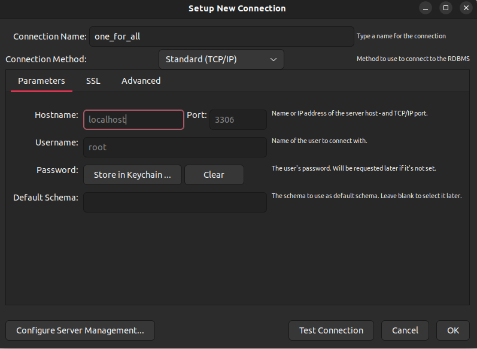
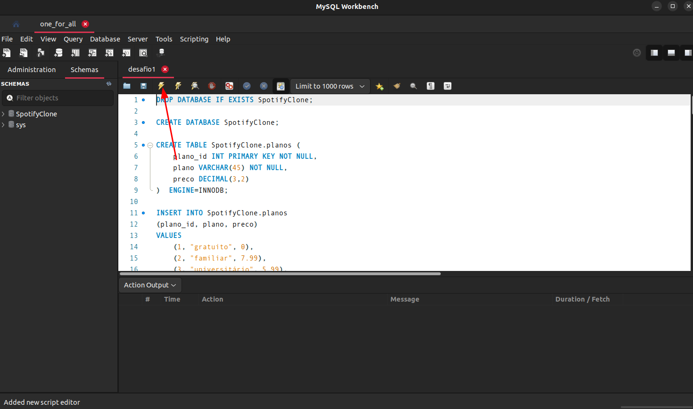
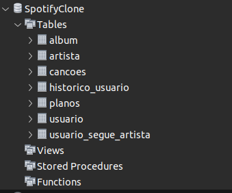

# One for all

## Contexto

Este projeto trata-se de uma desafios Mysql:

- Problema a ser resolvido:
  Recebi uma tabela não normalizada semelhante ao que poderia ser uma versão simplificada do banco de dados do Spotify. O trabalho consistirá de duas partes:

  Normalizar essa tabela, criar o schema no seu banco de dados local e populá-lo;

  Realizar os desafios no seu banco normalizado e populado;

  3ª Forma normal

> Utiliza a [Tabela Não normalizada](SpotifyClone-Non-NormalizedTable.xlsx)

## Técnologias usadas

Back-end:
> Desenvolvido usando: Mysql, Docker, Docker Compose

## Habilidades

Adquiri essas habilidades ao desenvolver esse projeto:

- Analisar se duas tabelas não normalizadas;

- Identificar modificações necessárias para que suas tabelas estejam adequadamente na 1ª, 2ª e 3ª Forma Normais;

- Criar um banco de dados a partir de uma planilha que contém tabelas e dados;

- Criar e modelar tabelas;

- Queries que passam pelos principais comandos SQL vistos até o momento;

## Instalando Dependências

- clone o projeto:

  ```bash
  git clone git@github.com:Andreyrvs/23-mysql-one-for-all.git
  ```

  > Banco de dados

    ```bash
    cd 23-mysql-one-for-all
    docker-compose up -d
    docker exec -it one_for_all bash
    npm ci
    ```

## Executando aplicação

É necessário ter [Mysql Workbench](https://www.mysql.com/products/workbench/) ou similar para rodar a as Queryes.

- Para rodar o Banco de dados:

  | 1. Crie uma conexão | 2. Use as credenciais e a senha: `password` |
  | ----------- | ----------- |
  |  |  |
  | 3. Importe o arquivo `desafio1.json` | 4. Execute a Query clicando no **Raio** :zap: |
  |  |  |
  | 5. Clique no botão :arrows_counterclockwise: apontado na imagem a seguir para atualizar a listagem de banco de dados. | 6. O banco de dados deverá ter essas tabelas populadas |
  |  |  |

### Para executar os desafios faça os **passos 3 e 4** para cada arquivo ex: `desafioN.sql`.
