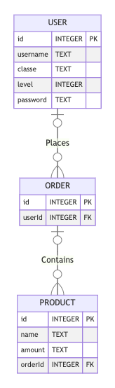

# Trybe Smith

## Contexto

Este projeto trata-se de uma loja de itens medievais no formato de uma api usando TypeScript. Utiliza arquitetura MSC onde é possivél fazer operaçoếs básicas em um determinado banco de dados: Criação, Leitura, Atualização e Exclusão (CRUD - Create, Read, Update e Delete).

<!-- 
> Utiliza a API []()
 -->

<!-- 
Colegas que contribuíram para a realização do projeto:

- [@colega1](https://github.com/ "github")
- [@colega2](https://github.com/ "github")
 -->

## Técnologias usadas

Back-end:
> Desenvolvido usando: Typescript, Node.js, Express.js, MYSQL, JWT

## Habilidades

Adquiri essas habilidades ao desenvolver esse projeto:

- Declarar variáveis e funções com tipagens Typescript;

- Construir uma API Node Express utilizando o Typescript;

## Preview da Aplicação

| Swagger | Diagrama DER |
| :---: | :---: |
|  |  |

## Instalando Dependências

- clone o projeto:

  ```bash
  git clone git@github.com:Andreyrvs/28-trybe-smith.git
  ```

> Docker

  :heavy_exclamation_mark: Rode os serviços **node** e **database** com o comando.

  ```bash
  docker-compose up -d
  ```

  > Esses serviços irão inicializar um container chamado `trybesmith` e outro chamado `trybesmith_db`.

  ```bash
  docker exec -it trybesmith bash
  ```

  > Back-end

  ```bash
  npm install
  ```

## Executando aplicação

É necessário ter [Mysql Workbench](https://www.mysql.com/products/workbench/) ou similar para rodar a as Queryes.

- Para rodar o Banco de dados:

  | 1. Crie uma conexão | 2. Use as credenciais que estão em `.env-example` |
  | ----------- | ----------- |
  |  |  |
  | 3. Importe o arquivo `Trybesmith.sql` | 4. Execute a Query clicando no **Raio** :zap: |
  |  |  |
  | 5. Clique no botão :arrows_counterclockwise: apontado na imagem a seguir para atualizar a listagem de banco de dados. | 6. O banco de dados deverá ter essas tabelas populadas |
  |  |  |

- Para rodar o Back-end:

  ```bash
  npm start
  ```

  - Modo devenvolvedor:

    ```bash
    npm run dev
    ```
