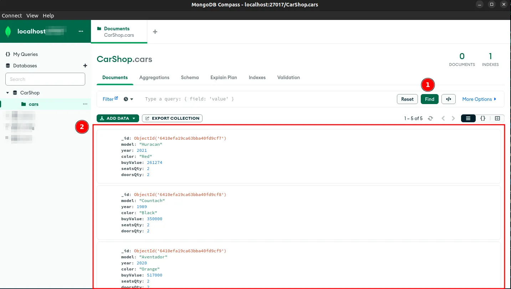

# Car Shop

## Contexto

Este projeto trata-se de  aplicar os princípios de Programação Orientada a Objetos (POO) para a construção de uma API com CRUD para gerenciar uma concessionária de veículos. Isso será feito utilizando o banco de dados MongoDB.

<!-- 
> Utiliza a API []()
 -->

<!-- 
Colegas que contribuíram para a realização do projeto:

- [@colega1](https://github.com/ "github")
- [@colega2](https://github.com/ "github")
 -->

## Técnologias usadas

Back-end:
> Desenvolvido usando: nodejs, ExpressJS, MongoDB, MYSQL, ES6

## Habilidades

Adquiri essas habilidades ao desenvolver esse projeto:

- Exercitar o conhecimento dos pilares da Programação Orientada a Objetos: Herança, Abstração, Encapsulamento e Polimorfismo;

- Exercitar a utilização de Composição;

- Exercitar a criação e utilização de Interfaces;

- Implementar, em TypeScript: Classes, Instâncias, Atributos, Métodos e Objetos;

- Aplicar os conhecimentos de MongoDB, Typescript e POO para criar uma API com CRUD.
<!-- 
## Preview da Aplicação

|  |  |
| ----------- | ----------- | -->

## Instalando Dependências

- clone o projeto:

  ```bash
  git clone git@github.com:Andreyrvs/32-car-shop.git
  cd 32-car-shop
  ```

  > Banco de dados

- Para restaurar o Banco de dados use `mongoimport`:

  ```bash
  mongoimport --db=CarShop --collection=cars --jsonArray --file=cars.json
  ```

  Irá aparecer algo como:

  ```bash
  2023-03-14T19:51:10.567-0300 connected to: mongodb://localhost/
  2023-03-14T19:51:10.569-0300 5 document(s) imported successfully. 0 document(s) failed to import.

  ```

  Usando o `mongosh` faça um **find** no banco de dados e verifique se foram carregado os carros:

  ```bash
  use CarShop
  db.cars.find({})
  ```

  Ou
  |.    |  Usando o `MongoDB Compass` Click no Find (1), resultado (2) |.      |
  | --- | :---:                                                          | ---   |
  |     |  |               |       |
  |.    |                                                                |.      |

  > Docker

  Rode os serviços **node** e **mongodb** com o comando:

  ```bash
  docker compose up -d
  ```

  Esses serviços irão inicializar um container chamado `car_shop` e outro chamado `car_shop_db`.

  ```bash
  docker exec -it car_shop bash
  ```

  > Back-end

  ```bash
  npm install
  ```

## Executando aplicação

- Para rodar o Back-end:

  ```bash
  npm run dev
  ```

## Executando testes

- Para rodar os testes:

  ```bash
  npm run test:dev
  ```

- Para rodar a cobertura de testes:

  ```bash
  npm run test:coverage
  ```
