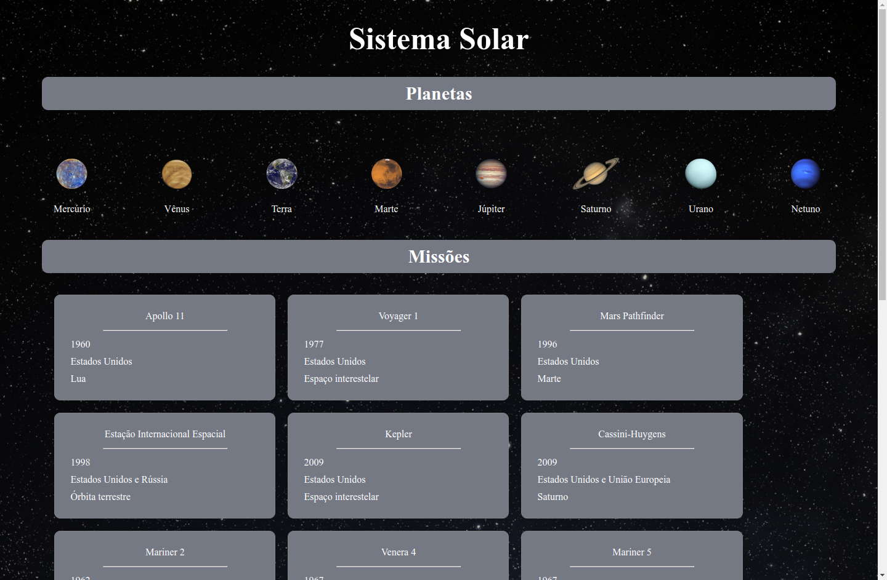
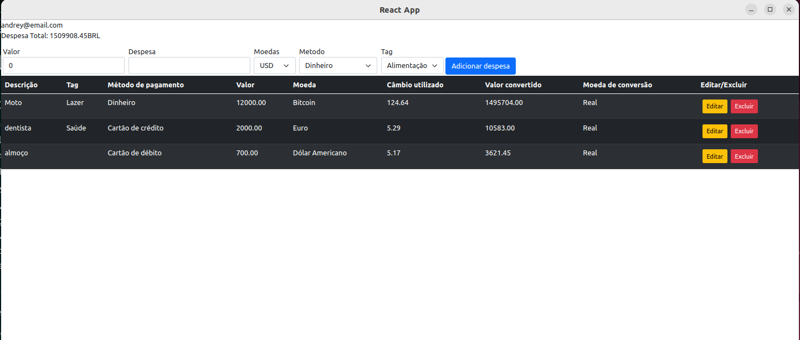

# Solar System

## Contexto

Este projeto visa simular uma visualização do Sistema Solar, bem como fornecer informações sobre diversas missões espaciais que ocorreram ao longo da história.

## Técnologias usadas

Front-end:
> Desenvolvido usando: React, PropTypes.

## Habilidades

Adquiri essas habilidades ao desenvolver esse projeto:

- Utilizar JSX no React

- Utilizar corretamente o método render() para renderizar seus componentes

- Utilizar import para trazer componentes em diferentes arquivos

- Criar componentes de classe em React

- Criar múltiplos componentes a partir de um array

- Usar props corretamente

- Usar PropTypes para validar as props de um componente

## Preview da Aplicação

|  |  |
| ----------- | ----------- |


## Instalando Dependências

- Clone o projeto:

  ```bash
  git clone git@github.com:Andreyrvs/12-React-Solar-System.git
  ```

  > Front-end

  ```bash
  cd 12-React-Solar-System/
  npm install
  ```

## Executando aplicação

- Para rodar o Front-end:

  ```bash
  cd src/ && npm start
  ```
