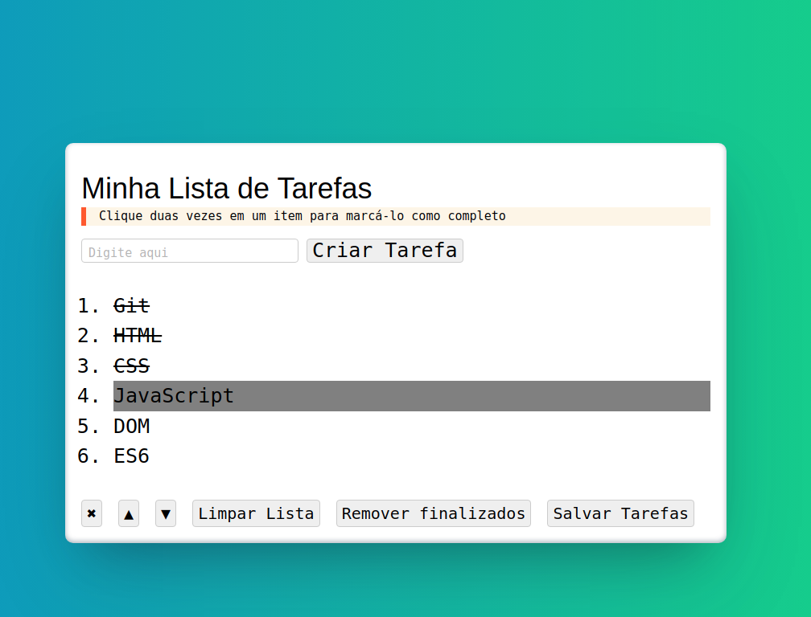

# Todo List 2.0

## Contexto

Segunda versão de [Todo list](https://github.com/Andreyrvs/04-Todo-List)

Este projeto trata-se de lista de tarefas onde é possivel adicionar, selecionar, marcar como concluido, limpar todas as tarefas ou apenas as marcadas.

Nessa versão é possivel remover tarefas finalizadas, remover apenas uma tarefa, tocar as tarefas de ordem e salvar as tarefas no local storage.

## Aplicação



## Técnologias usadas

Front-end:
> Desenvolvido usando: HTML, CSS, JavaScript

## Instalando Dependências

* clone o projeto:

  ```bash
  git clone git@github.com:Andreyrvs/04-v2-Todo-List.git
  ```

## Executando aplicação

* Para rodar o front-end:

  ```bash
  cd 04-v2-Todo-List
  ```

* Clique duas vezes no arquivo `index.html`

> A aplicação utiliza a resolução **1366 x 768**
