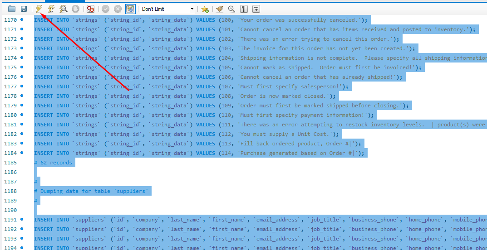

# All for one

## Contexto

Este projeto trata-se de uma série de desafios com diferentes níveis de complexidade que devem ser resolvidos cada um em seu arquivo próprio. O arquivo desafioN.. tem apenas o código SQL do desafio resolvido.

> Utiliza o banco de dados [`Northwind`](northwind.sql)

## Técnologias usadas

Back-end:
> Desenvolvido usando: MySQL, Docker Compose

## Habilidades

Adquiri essas habilidades ao desenvolver esse projeto:

- As queries que eu desenvolvi devem retornar exatamente a quantidade de colunas e registros esperados, dentro do que foi pedido;

- Organização do meu código. Deixar sempre as palavras-chave em CAIXA ALTA e os nomes de tabelas e colunas em caixa baixa;

## Instalando Dependências

- clone o projeto:

  ```bash
  git clone git@github.com:Andreyrvs/22-mysql-all-for-one.git
  ```

  > Back-end

  ```bash
  cd 22-mysql-all-for-one
  #  Rode os serviços node e db com o comando.
  docker-compose up -d
  #  acesso ao terminal interativo do container criado pelo compose.
  docker exec -it all_for_one bash
  npm ci
  ```

## Executando aplicação

É necessário ter [Mysql Workbench](https://www.mysql.com/products/workbench/) ou similar para rodar a as Queryes.

| 1. Crie uma nova coneção | 2. Utilize as credenciaise a senha: `password` |
| ----------- | ----------- |
|  |  |
| 3.  Importe o arquivo [`northwind.sql`](northwind.sql)  | 4. Execute a Query clicando no **Raio** :zap: |
|   |  |
| 5. Clique no botão :arrows_counterclockwise: apontado na imagem a seguir para atualizar a listagem de banco de dados. | 6. O banco de dados deverá ter essas tabelas populadas |
  |  |  |

### Para executar os desafios faça os **passos 3 e 4** para cada arquivo ex: `desafioN.sql`
